  

  

  
  
  
  

  
  
  

 

<table>
  <tr>
    <td width="64%" valign="top">
      <h2>About Me</h2>
      

        I am <strong>Manohar Eldhandi</strong>, a <strong>Software Engineer Trainee at Cisco</strong> working across generative AI systems and backend engineering.
        I like building AI systems that do real work: workflows connected to tools, RAG over useful context,
        MCP servers, reliable APIs, audit trails, and tests that keep everything honest.
      

      <ul>
        <li>Software Engineer Trainee at <strong>Cisco</strong>, Bengaluru.</li>
        <li>Focused on <strong>generative AI systems, MCP, LangGraph, RAG, backend APIs, and automation</strong>.</li>
        <li>Comfortable moving between product logic, data flow, model integration, and test automation.</li>
        <li>Competitive programming background: Codeforces Expert, CodeChef 4 star, and over 500 LeetCode problems.</li>
      </ul>
    </td>
    <td width="36%" align="center" valign="middle">
       
      Practical AI systems, reliable backend code.
    </td>
  </tr>
</table>

## Engineering Focus

<table>
  <tr>
    <td width="33%" valign="top">
      <h3>Generative AI Systems</h3>
      
LangGraph workflows, MCP servers, tool-calling assistants, RAG pipelines, vector retrieval, prompt engineering, and AI-backed engineering tooling.

    </td>
    <td width="33%" valign="top">
      <h3>Backend Platforms</h3>
      
Spring Boot, Django, FastAPI, REST APIs, JWT/OAuth, Spring Security, MySQL schemas, audit logging, and clean service-layer design.

    </td>
    <td width="33%" valign="top">
      <h3>Quality</h3>
      
Playwright E2E automation, JUnit coverage, API testing, Swagger/OpenAPI docs, CI/CD confidence, and regression-safe release flows.

    </td>
  </tr>
</table>

## At Cisco

  
  
  
  

- Building an AI-powered security compliance automation tool that reduces manual code review effort by about 60%.
- Designed and deployed an MCP server that connects internal engineering tools with AI assistants.
- Built LangGraph-based agent workflows with RAG and vector retrieval for code and compliance analysis.
- Engineered REST APIs, MySQL schemas, and audit logging pipelines for release-level traceability.
- Developed Playwright end-to-end automation for a large-scale internal Cisco application.

## Stack

  

  
  
  
  
  
  
  
  
  
  

## Builds

<table>
  <tr>
    <td width="50%" valign="top">
      <h3><a href="https://github.com/ManoharEldhandi/ontheway-backend">OnTheWay</a></h3>
      
<strong>Route-based preordering backend</strong>

      <ul>
        <li>Built 27 REST APIs for users, merchants, and admins.</li>
        <li>Implemented JWT/RBAC with Spring Security.</li>
        <li>Added order tracking, inventory APIs, Swagger docs, and JUnit coverage.</li>
      </ul>
      
<strong>Stack:</strong> Java, Spring Boot, MySQL, JWT, JUnit

    </td>
    <td width="50%" valign="top">
      <h3><a href="https://github.com/ManoharEldhandi/WaterNet">WaterNet</a></h3>
      
<strong>Real-time water quality assessment</strong>

      <ul>
        <li>Built a Django API for water potability prediction.</li>
        <li>Used 9 chemical parameters with model comparison.</li>
        <li>Supported sensor input, batch CSV flow, and MySQL logging.</li>
      </ul>
      
<strong>Stack:</strong> Python, Django, scikit-learn, XGBoost, MySQL

    </td>
  </tr>
  <tr>
    <td width="50%" valign="top">
      <h3><a href="https://github.com/ManoharEldhandi/HackerEarth-Machine-Learning-challenge--World-Water-Day">Smart Water Monitoring</a></h3>
      
<strong>HackerEarth ML challenge solution</strong>

      <ul>
        <li>Built an XGBoost forecasting workflow.</li>
        <li>Added time-based features and preprocessing steps.</li>
        <li>Created reusable inference and submission logic.</li>
      </ul>
      
<strong>Stack:</strong> Python, XGBoost, feature engineering, ML pipeline

    </td>
    <td width="50%" valign="top">
      <h3>AI Security Compliance Automation</h3>
      
<strong>Generative AI compliance workflow</strong>

      <ul>
        <li>Built around code and compliance analysis.</li>
        <li>Connected assistants to tools and engineering context.</li>
        <li>Ranked Top 35 among over 2,000 Cisco hackathon teams.</li>
      </ul>
      
<strong>Stack:</strong> LangGraph, MCP, RAG, backend APIs, Playwright

    </td>
  </tr>
</table>

## Coding Profiles

  

  
  
  

## Achievements

| Area | Result |
| --- | --- |
| Amazon ML Summer School 2024 | Selected in the top 1% from over 50,000 applicants |
| HackerEarth ML Challenge | Top 50 globally among over 20,000 participants |
| CodeChef | 4 star, rating 1893, global rank 13 in Starters 147D |
| Codeforces | Expert, max rating 1785, rank 252 out of over 24,000 in a Division 2 contest |
| Smart Interviews | Mentored over 150 students in DSA and earned Smart Coder National Certificate, Top 2% nationally |
| Cisco WebEx Playtime Hackathon | Top 35 among over 2,000 teams with an AI security compliance automation idea |

## Education

**B.Tech in Computer Science and Engineering, AI & ML specialization** 
CMR Institute of Technology, Hyderabad, affiliated to JNTU Hyderabad 
CGPA: 8.48

## How I Build

- AI workflows should be connected to real tools, real data, and clear boundaries.
- Backend APIs should be understandable, secure, testable, and easy to extend.
- AI features should produce traceable outputs, not mysterious magic.
- Competitive programming habits help me reason through edge cases, constraints, and performance.

  

