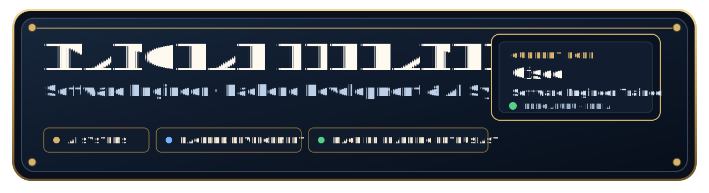
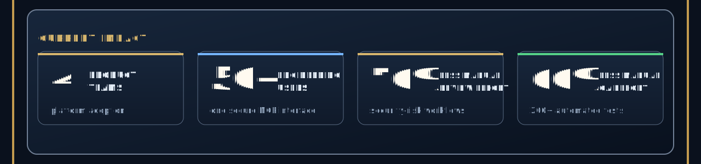
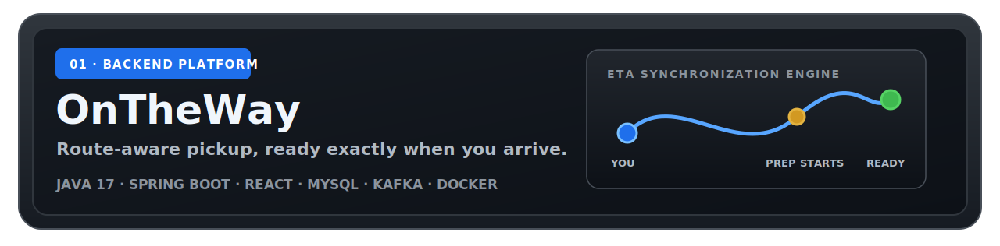
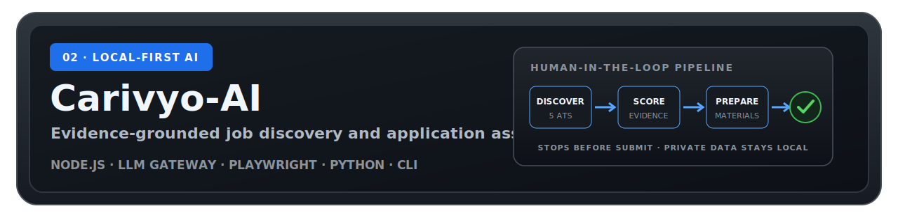
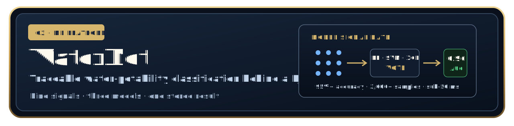

  

  &nbsp;
  &nbsp;
  &nbsp;
  

## About

I work mainly with backend development and AI systems. At Cisco, I contribute to internal security-compliance tooling built around authenticated services, MCP integrations, retrieval-backed workflows, audit trails, and test automation.

Outside work, I build complete projects to learn how the pieces fit together, from APIs and data models to testing and deployment. Recent projects include a route-aware pickup platform, a local-first job-search assistant, and a water-quality ML application.

  <kbd>AI SYSTEMS</kbd>&nbsp;
  <kbd>BACKEND DEVELOPMENT</kbd>&nbsp;
  <kbd>MACHINE LEARNING ENTHUSIAST</kbd>

## Current work

As a **Software Engineer Trainee at Cisco**, I build Python backend services, MCP and RAG integrations, agentic workflows, API validation, authentication, audit logging, and release automation. I also maintain regression coverage across large release workflows with Playwright, JUnit, and CI/CD.

> Product names and internal implementation details are intentionally kept private.

## Selected builds

I designed the route and fulfillment logic, secure multi-role backend, order and payment state flows, searchable catalog, and customer, merchant, and admin experiences. The demo dataset contains **115 shops and 507 items**; the project includes **72 tests**, a simulated **1,000-user load test**, Docker, Kubernetes, and CI.

[Repository](https://github.com/ManoharEldhandi/OnTheWay) · [Architecture](https://github.com/ManoharEldhandi/OnTheWay/blob/main/ARCHITECTURE.md) · [Run it](https://github.com/ManoharEldhandi/OnTheWay/blob/main/docs/USAGE.md)

 

I built a local-first pipeline that discovers roles across **five ATS connectors** and public career pages, explains match quality, generates evidence-grounded materials, and prepares browser-assisted dry runs. Privacy gates keep personal data local, and the apply worker always stops before submission for human review.

[Repository](https://github.com/ManoharEldhandi/Carivyo-AI) · [Architecture](https://github.com/ManoharEldhandi/Carivyo-AI/blob/servant/docs/ARCHITECTURE.md) · [Safety model](https://github.com/ManoharEldhandi/Carivyo-AI/blob/servant/docs/APPLICATION_POLICIES.md)

 

I trained a voting ensemble over nine water-chemistry features and served it through a Django API with authenticated workflows and traceable persistence. The reproducible evaluation reports **95%+ accuracy and 0.96 AUC** on a **3,000+ sample** dataset, with **1,000+ inference requests** handled at sub-50 ms latency.

[Repository](https://github.com/ManoharEldhandi/WaterNet) · [Project overview](https://github.com/ManoharEldhandi/WaterNet#model--performance)

## Engineering toolkit

<table>
  <tr>
    <td width="50%" valign="top">
      <strong>Backend systems</strong>  
      <code>Java</code> <code>Python</code> <code>JavaScript</code> <code>Spring Boot</code> <code>Node.js</code> <code>Django</code> <code>REST</code> <code>MySQL</code>
        Secure service layers, stateful workflows, relational data models, API contracts, and multi-role authorization.
    </td>
    <td width="50%" valign="top">
      <strong>AI systems</strong>  
      <code>MCP</code> <code>RAG</code> <code>LangGraph</code> <code>LangChain</code> <code>LLM APIs</code> <code>Vector Retrieval</code> <code>Prompt Engineering</code>
        Tool-connected workflows with retrieval, structured outputs, auditability, and explicit no-fabrication boundaries.
    </td>
  </tr>
  <tr>
    <td width="50%" valign="top">
      <strong>Quality &amp; testing</strong>  
      <code>Playwright</code> <code>JUnit 5</code> <code>API Testing</code> <code>Swagger</code> <code>OpenAPI</code> <code>CI/CD</code>
        Regression automation, reliable test evidence, failure debugging, and release-safety checks built into delivery.
    </td>
    <td width="50%" valign="top">
      <strong>ML &amp; delivery</strong>  
      <code>scikit-learn</code> <code>XGBoost</code> <code>TensorFlow</code> <code>Docker</code> <code>AWS</code> <code>GitHub Actions</code> <code>Linux</code>
        Practical model pipelines, reproducible evaluation, containerized services, and automated builds and validation.
    </td>
  </tr>
</table>

## Experience &amp; education

<table>
  <tr>
    <td width="24%" valign="top">
      <strong>Oct 2025 — Present</strong> 
      Bengaluru, India
    </td>
    <td width="76%" valign="top">
      <strong>Software Engineer Trainee · Cisco Systems</strong>  
      Building an internal AI security-compliance platform used by four product teams; developing backend services, MCP/RAG workflows, audit logging, validation, and release automation for 50+ engineers.
    </td>
  </tr>
  <tr>
    <td width="24%" valign="top">
      <strong>2024</strong> 
      Hyderabad, India
    </td>
    <td width="76%" valign="top">
      <strong>DSA Mentor · Smart Interviews</strong>  
      Mentored 150+ students in structured problem solving, debugging, and optimization, contributing to a 40% average improvement in practice-assessment performance.
    </td>
  </tr>
  <tr>
    <td width="24%" valign="top">
      <strong>Dec 2021 — Jul 2025</strong> 
      Hyderabad, India
    </td>
    <td width="76%" valign="top">
      <strong>B.Tech, Computer Science &amp; Engineering · AI &amp; ML</strong>  
      CMR Institute of Technology, affiliated to JNTU Hyderabad · <strong>CGPA 8.48 / 10</strong>
    </td>
  </tr>
</table>

## Problem solving

<table>
  <tr>
    <td width="33.33%" align="center">
      <a href="https://codeforces.com/profile/ACatLastTry"><strong>Codeforces</strong></a>  
      <code>MASTER · 2141</code>  
      Rank 252 of 24,000+ in a Division 2 round
    </td>
    <td width="33.33%" align="center">
      <a href="https://www.codechef.com/users/acatlasttry"><strong>CodeChef</strong></a>  
      <code>4-STAR · 1893</code>  
      Global rank 13 in Starters 147
    </td>
    <td width="33.33%" align="center">
      <a href="https://leetcode.com/u/ManoharEldhandi/"><strong>LeetCode</strong></a>  
      <code>557 SOLVED</code>  
      Java-first practice across graphs, DP, and patterns
    </td>
  </tr>
</table>

## Milestones &amp; community

- **Amazon ML Summer School 2024:** selected in the top 1% of 50,000+ applicants for the national machine-learning program.
- **HackerEarth ML Challenge:** placed in the global Top 50 of 20,000+ participants with an XGBoost forecasting model.
- **Cisco Webex Playtime Hackathon:** placed Top 35 of 2,000+ teams with an AI security-compliance automation tool.
- **Smart Coder National Certificate:** ranked in the top 2%, then returned as a mentor for 150+ DSA learners.
- **Open source:** created [LER_DSA](https://github.com/ManoharEldhandi/LER_DSA), a free 30-day Java interview roadmap with 20 modules, reusable templates, revision rules, and a progress tracker.

## Contact

  <strong>Open to conversations about software engineering, backend development, AI/LLM systems, machine learning, developer productivity, and security automation.</strong>

  <a href="mailto:manohareldhandi@outlook.com">Email</a>&nbsp;&nbsp;·&nbsp;&nbsp;
  <a href="https://www.linkedin.com/in/manohar-eldhandi/">LinkedIn</a>&nbsp;&nbsp;·&nbsp;&nbsp;
  <a href="https://manohareldhandi.github.io/portfolio/">Portfolio</a>&nbsp;&nbsp;·&nbsp;&nbsp;
  <a href="https://manohareldhandi.github.io/Resume/">Resume</a>

