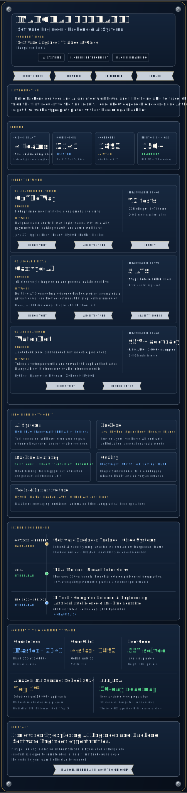

  

  
<strong>Open links and accessible text version</strong>

   

  **Navigation:** [Portfolio](https://manohareldhandi.github.io/portfolio/) · [Resume](https://manohareldhandi.github.io/Resume/) · [LinkedIn](https://www.linkedin.com/in/manohar-eldhandi/) · [Email](mailto:manohareldhandi@outlook.com)

  ### Profile

  **Manohar Eldhandi** — Software Engineer focused on backend development and AI systems. Software Engineer Trainee at Cisco in Bangalore, India.

  I build backend services and AI-assisted workflows, and I like being able to trace what happened from the first request to the final result. I care about dependable releases and AI that takes repetitive work off people’s plates without becoming a black box.

  ### Proof

  - Cisco platform adoption across **4 product teams and 50+ engineering users**.
  - [Codeforces Master — 2141](https://codeforces.com/profile/ACatLastTry), including rank 252 of 24,000+ in a Division 2 round.
  - [CodeChef 4-star — 1893](https://www.codechef.com/users/acatlasttry), including global rank 13 in Starters 147.
  - Mentored **150+ DSA learners** and created [LER_DSA](https://github.com/ManoharEldhandi/LER_DSA), a free 30-day Java roadmap with 20 modules.

  ### Selected work

  - **[OnTheWay](https://github.com/ManoharEldhandi/OnTheWay):** route-aware pickup and reservation platform with secure multi-role APIs, fulfillment logic, payment states, 72 tests, 115 shops, 507 items, and a 1,000-user load simulation. [Architecture](https://github.com/ManoharEldhandi/OnTheWay/blob/main/ARCHITECTURE.md) · [Usage](https://github.com/ManoharEldhandi/OnTheWay/blob/main/docs/USAGE.md)
  - **[Carivyo-AI](https://github.com/ManoharEldhandi/Carivyo-AI):** local-first job discovery and application support across five ATS connectors, with evidence-backed materials, privacy gates, and mandatory human review. [Architecture](https://github.com/ManoharEldhandi/Carivyo-AI/blob/servant/docs/ARCHITECTURE.md) · [Safety model](https://github.com/ManoharEldhandi/Carivyo-AI/blob/servant/docs/APPLICATION_POLICIES.md)
  - **[WaterNet](https://github.com/ManoharEldhandi/WaterNet):** voting-ensemble water-quality platform served through authenticated Django APIs, reporting 95%+ accuracy, 0.96 AUC, and sub-50 ms inference latency.

  ### Experience

  - **Software Engineer Trainee · Cisco Systems** — Oct 2025 to present.
  - **DSA Mentor · Smart Interviews** — 2024.
  - **B.Tech, Computer Science & Engineering · AI & ML** — CMR Institute of Technology, JNTU Hyderabad · CGPA 8.5/10.

  ### Supporting evidence

  [Codeforces](https://codeforces.com/profile/ACatLastTry) · [CodeChef](https://www.codechef.com/users/acatlasttry) · [LeetCode](https://leetcode.com/u/ManoharEldhandi/) · [LER_DSA](https://github.com/ManoharEldhandi/LER_DSA)

  **Open to:** I’m currently exploring AI Engineer and Backend Software Engineer opportunities in Hyderabad or Bangalore, and I’m also open to remote roles in India. If my background could be useful to your team, I’d be glad to connect.

  **Contact:** [manohareldhandi@outlook.com](mailto:manohareldhandi@outlook.com)

