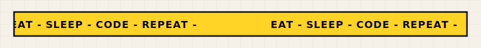
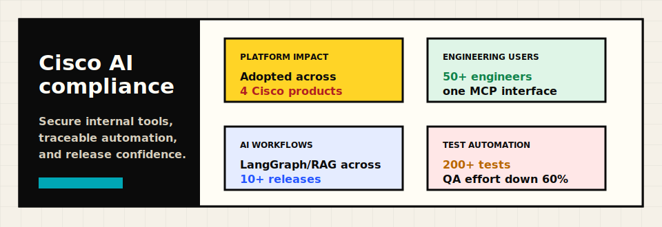
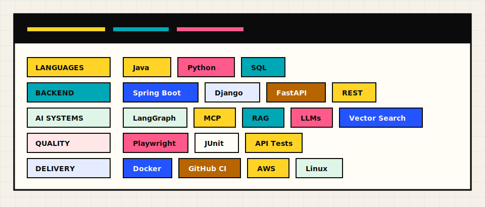
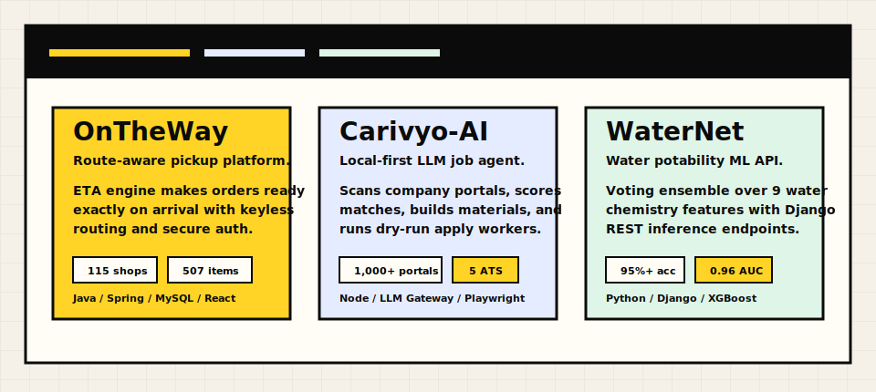
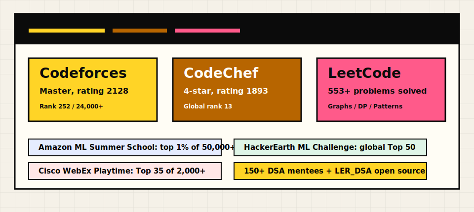

  

  
  
  
  

  

  

<h2 align="center">Current Work</h2>

  

<h2 align="center">Skills</h2>

  

<h2 align="center">Featured Builds</h2>

  

  
  
  

<h2 align="center">Coding Profiles & Highlights</h2>

  

  
  
  

<h2 align="center">Education</h2>

  <strong>B.Tech in Computer Science and Engineering, AI &amp; ML specialization</strong> 
  CMR Institute of Technology, Hyderabad, affiliated to JNTU Hyderabad 
  CGPA: 8.48

  

