

  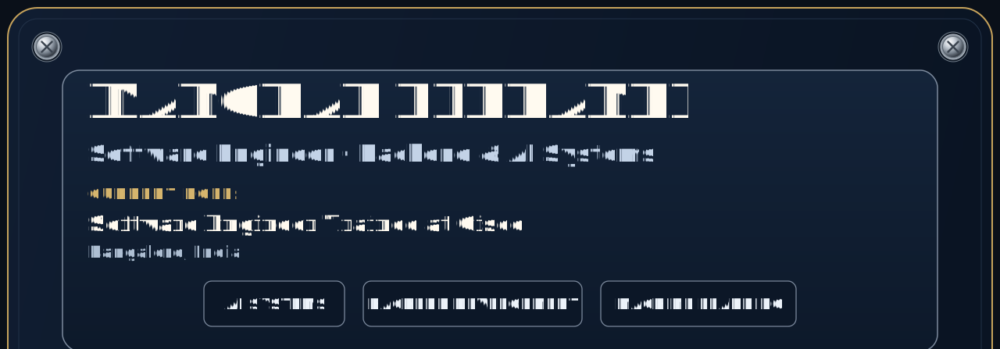
  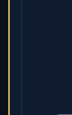<a href="https://manohareldhandi.github.io/portfolio/">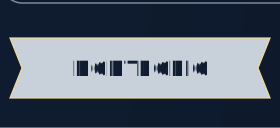</a><a href="https://www.linkedin.com/in/manohar-eldhandi/">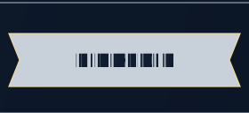</a><a href="mailto:manohareldhandi@outlook.com">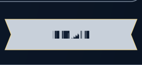</a>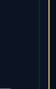
  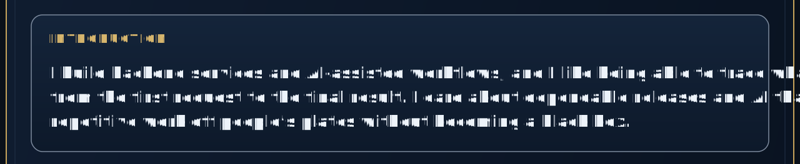
  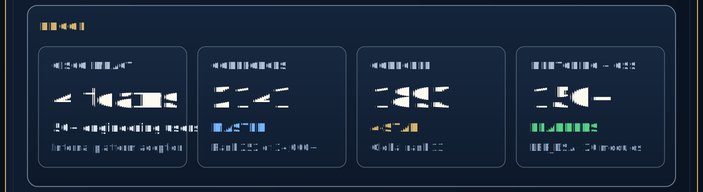
  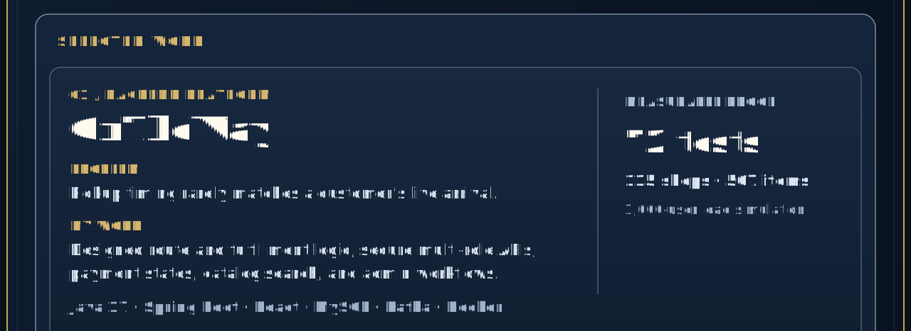
  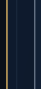<a href="https://github.com/ManoharEldhandi/OnTheWay">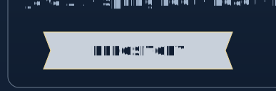</a><a href="https://github.com/ManoharEldhandi/OnTheWay/blob/main/ARCHITECTURE.md">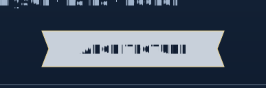</a>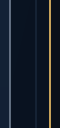
  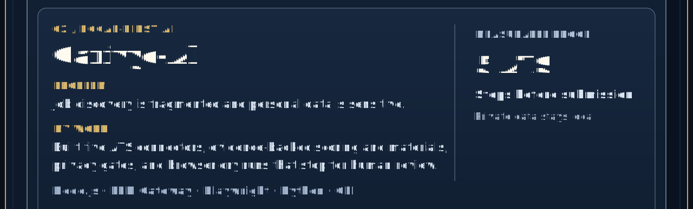
  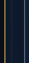<a href="https://github.com/ManoharEldhandi/Carivyo-AI">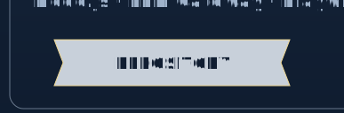</a><a href="https://github.com/ManoharEldhandi/Carivyo-AI/blob/servant/docs/ARCHITECTURE.md">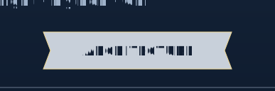</a>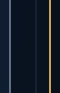
  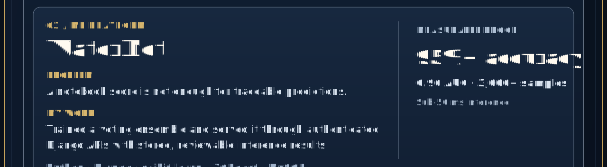
  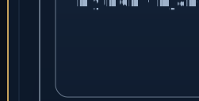<a href="https://github.com/ManoharEldhandi/WaterNet">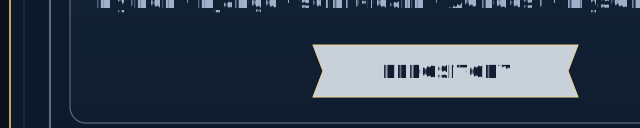</a><a href="https://github.com/ManoharEldhandi/WaterNet#model--performance">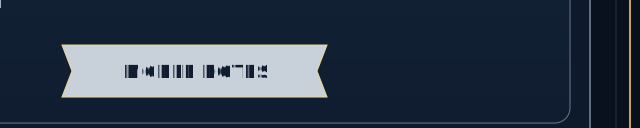</a>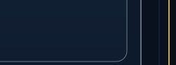
  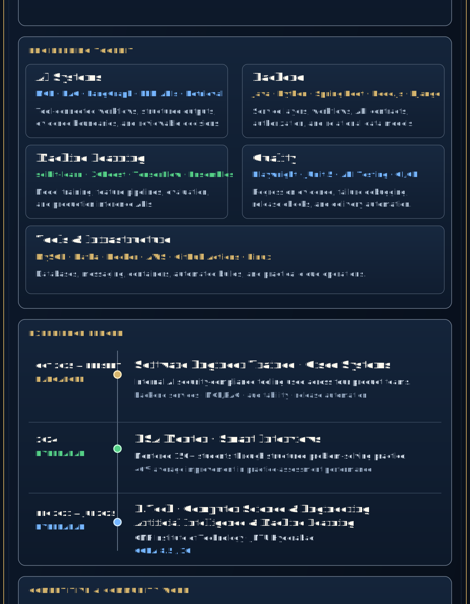
  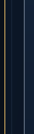<a href="https://codeforces.com/profile/ACatLastTry">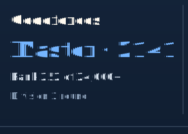</a><a href="https://www.codechef.com/users/acatlasttry">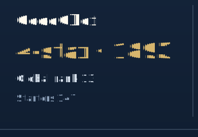</a><a href="https://leetcode.com/u/ManoharEldhandi/">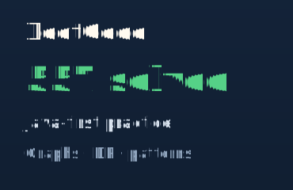</a>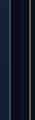
  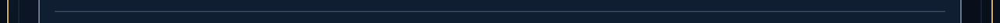
  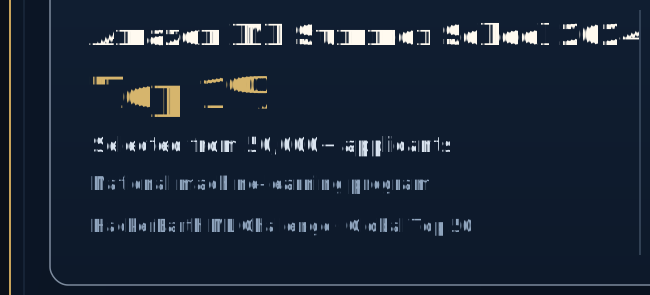<a href="https://github.com/ManoharEldhandi/LER_DSA">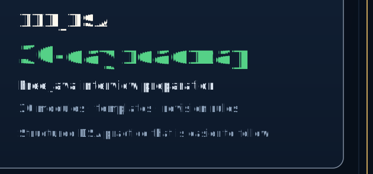</a>
  <a href="mailto:manohareldhandi@outlook.com">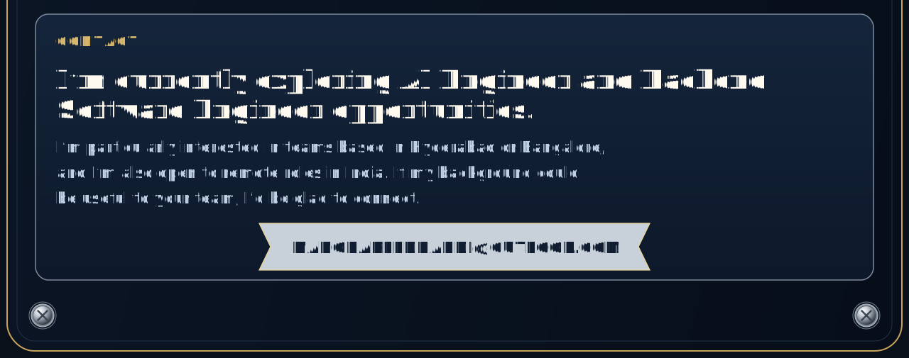</a>
   

