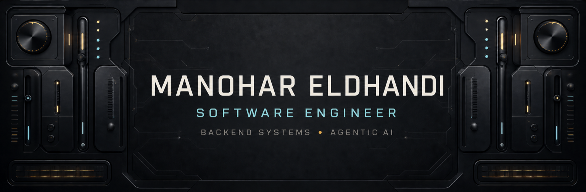

  

  

  

  

<picture>
  <source media="(prefers-color-scheme: dark)" srcset="https://raw.githubusercontent.com/ManoharEldhandi/ManoharEldhandi/output/github-contribution-grid-snake-dark.svg">
  <source media="(prefers-color-scheme: light)" srcset="https://raw.githubusercontent.com/ManoharEldhandi/ManoharEldhandi/output/github-contribution-grid-snake.svg">
  
</picture>

Accessible text profile

### Manohar Eldhandi

Software Engineer at Cisco Systems in Bengaluru, India, focused on backend engineering, security automation, and applied AI.

- Built an internal AI security-compliance platform used by more than 50 engineers across four Cisco product teams, reducing manual security review by 70%.
- Built an 11-phase deterministic-first LLM pipeline with code-graph analysis and concurrent inference, reducing model API calls by 10x.
- Codeforces Master at 2141 and CodeChef 4-star at 1893.
- Author of [LER_DSA](https://github.com/ManoharEldhandi/LER_DSA), a 30-day Java DSA roadmap with 20 modules.
- Selected in the top 1% of 50,000+ applicants for Amazon ML Summer School 2024.

Selected work: [OnTheWay](https://github.com/ManoharEldhandi/OnTheWay), [Carivyo-AI](https://github.com/ManoharEldhandi/Carivyo-AI), and [WaterNet](https://github.com/ManoharEldhandi/WaterNet).

[Portfolio](https://manohareldhandi.github.io/portfolio/) · [Resume](https://manohareldhandi.github.io/Resume/) · [LinkedIn](https://www.linkedin.com/in/manohar-eldhandi/) · [Email](mailto:manohareldhandi@outlook.com)

