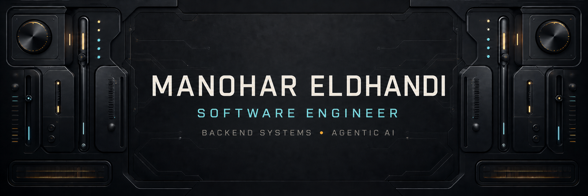

  

  <strong>Software Engineer at Cisco Systems</strong> 
  BENGALURU, INDIA &nbsp; / &nbsp; BACKEND ENGINEERING &nbsp; / &nbsp; SECURITY AUTOMATION &nbsp; / &nbsp; APPLIED AI

  <a href="https://manohareldhandi.github.io/portfolio/"><kbd>PORTFOLIO</kbd></a>&nbsp;
  <a href="https://manohareldhandi.github.io/Resume/"><kbd>RESUME</kbd></a>&nbsp;
  <a href="https://www.linkedin.com/in/manohar-eldhandi/"><kbd>LINKEDIN</kbd></a>&nbsp;
  <a href="mailto:manohareldhandi@outlook.com"><kbd>EMAIL</kbd></a>

 

## 01 / Impact console

<table>
  <tr>
    <td width="25%" align="center">
      <strong>50+</strong> 
      ENGINEERS ENABLED
    </td>
    <td width="25%" align="center">
      <strong>4</strong> 
      CISCO PRODUCT TEAMS
    </td>
    <td width="25%" align="center">
      <strong>70%</strong> 
      LESS MANUAL REVIEW
    </td>
    <td width="25%" align="center">
      <strong>10x</strong> 
      FEWER MODEL CALLS
    </td>
  </tr>
</table>

I build reliable backend services, security-compliance automation, and agentic AI workflows at **Cisco Systems**. My recent work includes an internal security platform used across four product teams and an 11-phase deterministic-first LLM pipeline with code-graph analysis and concurrent inference.

> [!NOTE]
> I care about measurable systems: clear trust boundaries, low false-positive rates, observable behavior, and tests that prove the software works beyond the happy path.

## 02 / Selected systems

<table>
  <tr>
    <td width="32%" valign="top">
      <h3>OnTheWay</h3>
      
<strong>ROUTE-AWARE COMMERCE</strong>

      
<code>Java 17</code> <code>Spring Boot</code> <code>Kafka</code> <code>Elasticsearch</code> <code>React</code> <code>Kubernetes</code>

    </td>
    <td width="68%" valign="top">
      
A pickup platform that synchronizes store preparation with a customer's live ETA across restaurants, pharmacies, groceries, and other verticals.

      
<strong>115 shops</strong> &middot; <strong>507 items</strong> &middot; <strong>70+ tests</strong> &middot; <strong>1,000-user load run</strong>

      
<a href="https://github.com/ManoharEldhandi/OnTheWay"><kbd>REPOSITORY</kbd></a>&nbsp; <a href="https://github.com/ManoharEldhandi/OnTheWay/blob/main/ARCHITECTURE.md"><kbd>ARCHITECTURE</kbd></a>&nbsp; <a href="https://github.com/ManoharEldhandi/OnTheWay/blob/main/docs/USAGE.md"><kbd>RUN IT</kbd></a>

    </td>
  </tr>
</table>

<table>
  <tr>
    <td width="50%" valign="top">
      <h3>Carivyo-AI</h3>
      
<strong>LOCAL-FIRST CAREER INTELLIGENCE</strong>

      
Evidence-grounded job discovery and user-approved resume workflows with four official ATS connectors, a 27-check diagnostic, and explicit prompt-injection defenses.

      
<code>React</code> <code>TypeScript</code> <code>FastAPI</code> <code>SQLite</code> <code>LLM APIs</code>

      
<a href="https://github.com/ManoharEldhandi/Carivyo-AI"><kbd>REPOSITORY</kbd></a>&nbsp; <a href="https://github.com/ManoharEldhandi/Carivyo-AI/blob/main/system.md"><kbd>SYSTEM</kbd></a>

    </td>
    <td width="50%" valign="top">
      <h3>WaterNet</h3>
      
<strong>TRACEABLE ML INFERENCE</strong>

      
A reproducible water-quality pipeline that evaluates six candidate models and serves a three-model voting ensemble through a Django inference API.

      
<strong>95%+ accuracy</strong> &middot; <strong>0.96 AUC</strong> &middot; <strong>sub-50 ms inference</strong>

      
<code>Python</code> <code>Django REST</code> <code>scikit-learn</code> <code>Pandas</code>

      
<a href="https://github.com/ManoharEldhandi/WaterNet"><kbd>REPOSITORY</kbd></a>&nbsp; <a href="https://github.com/ManoharEldhandi/WaterNet#model--performance"><kbd>MODEL NOTES</kbd></a>

    </td>
  </tr>
</table>

## 03 / Engineering console

<table>
  <tr>
    <td width="50%" valign="top">
      <strong>BACKEND + DISTRIBUTED SYSTEMS</strong>  
      <kbd>Java</kbd>&nbsp; <kbd>Python</kbd>&nbsp; <kbd>Spring Boot</kbd>&nbsp; <kbd>FastAPI</kbd>  
      <kbd>REST</kbd>&nbsp; <kbd>GraphQL</kbd>&nbsp; <kbd>Kafka</kbd>&nbsp; <kbd>Elasticsearch</kbd>  
      <kbd>MySQL</kbd>&nbsp; <kbd>SQLite</kbd>&nbsp; <kbd>WebSockets</kbd>
    </td>
    <td width="50%" valign="top">
      <strong>AGENTIC AI + MACHINE LEARNING</strong>  
      <kbd>MCP</kbd>&nbsp; <kbd>RAG</kbd>&nbsp; <kbd>LLM APIs</kbd>&nbsp; <kbd>LangGraph</kbd>  
      <kbd>Prompt Engineering</kbd>&nbsp; <kbd>LLM-as-Judge</kbd>  
      <kbd>scikit-learn</kbd>&nbsp; <kbd>XGBoost</kbd>&nbsp; <kbd>model evaluation</kbd>
    </td>
  </tr>
  <tr>
    <td width="50%" valign="top">
      <strong>QUALITY + RELIABILITY</strong>  
      <kbd>JUnit 5</kbd>&nbsp; <kbd>pytest</kbd>&nbsp; <kbd>Playwright</kbd>  
      <kbd>API Testing</kbd>&nbsp; <kbd>Load Testing</kbd>&nbsp; <kbd>Code Review</kbd>
    </td>
    <td width="50%" valign="top">
      <strong>DELIVERY + PLATFORM</strong>  
      <kbd>Docker</kbd>&nbsp; <kbd>Kubernetes</kbd>&nbsp; <kbd>GitHub Actions</kbd>  
      <kbd>CI/CD</kbd>&nbsp; <kbd>Git</kbd>&nbsp; <kbd>Agile</kbd>
    </td>
  </tr>
</table>

## 04 / Signal rack

<table>
  <tr>
    <td width="33%" align="center" valign="top">
      <strong>PROBLEM SOLVING</strong>  
      <a href="https://codeforces.com/profile/ACatLastTry"><strong>Codeforces Master</strong></a> 
      <code>2141 rating</code>  
      <a href="https://www.codechef.com/users/acatlasttry"><strong>CodeChef 4-star</strong></a> 
      <code>1893 rating</code>
    </td>
    <td width="34%" align="center" valign="top">
      <strong>OPEN SOURCE + COMMUNITY</strong>  
      Authored <a href="https://github.com/ManoharEldhandi/LER_DSA"><strong>LER_DSA</strong></a> 
      <code>30 days</code> <code>20 modules</code>  
      Mentored <strong>150+ learners</strong> 
      in data structures and algorithms
    </td>
    <td width="33%" align="center" valign="top">
      <strong>SELECTED + RECOGNIZED</strong>  
      <strong>Amazon ML Summer School 2024</strong> 
      <code>top 1% of 50,000+</code>  
      <strong>Cisco Webex Playtime</strong> 
      <code>top 35 of 2,000+ teams</code>
    </td>
  </tr>
</table>

## 05 / Contribution circuit

<picture>
  <source media="(prefers-color-scheme: dark)" srcset="https://raw.githubusercontent.com/ManoharEldhandi/ManoharEldhandi/output/github-contribution-grid-snake-dark.svg">
  <source media="(prefers-color-scheme: light)" srcset="https://raw.githubusercontent.com/ManoharEldhandi/ManoharEldhandi/output/github-contribution-grid-snake.svg">
  
</picture>

 

<table>
  <tr>
    <td align="center">
      <h3>Build something useful. Make the evidence visible.</h3>
      
For backend, platform, applied-AI, or open-source conversations:

      
<a href="mailto:manohareldhandi@outlook.com"><kbd>START A CONVERSATION</kbd></a>&nbsp; <a href="https://www.linkedin.com/in/manohar-eldhandi/"><kbd>CONNECT ON LINKEDIN</kbd></a>

    </td>
  </tr>
</table>
