

  <picture>
    <source media="(max-width: 600px)" srcset="./assets/profile/hero-mobile.svg">
    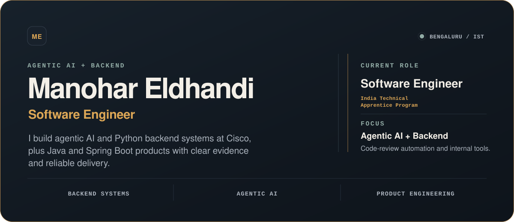
  </picture>

  <a href="https://manohareldhandi.github.io/portfolio/"><picture><source media="(max-width: 600px)" srcset="./assets/profile/nav-portfolio-mobile.svg">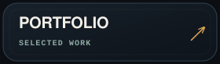</picture></a>&ensp;<a href="https://manohareldhandi.github.io/Resume/"><picture><source media="(max-width: 600px)" srcset="./assets/profile/nav-resume-mobile.svg">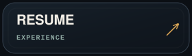</picture></a>&ensp;<a href="https://www.linkedin.com/in/manohar-eldhandi/"><picture><source media="(max-width: 600px)" srcset="./assets/profile/nav-linkedin-mobile.svg">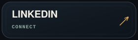</picture></a>&ensp;<a href="mailto:eldhandimanohar@gmail.com"><picture><source media="(max-width: 600px)" srcset="./assets/profile/nav-email-mobile.svg"></picture></a>

  <picture>
    <source media="(max-width: 600px)" srcset="./assets/profile/profile-mobile.svg">
    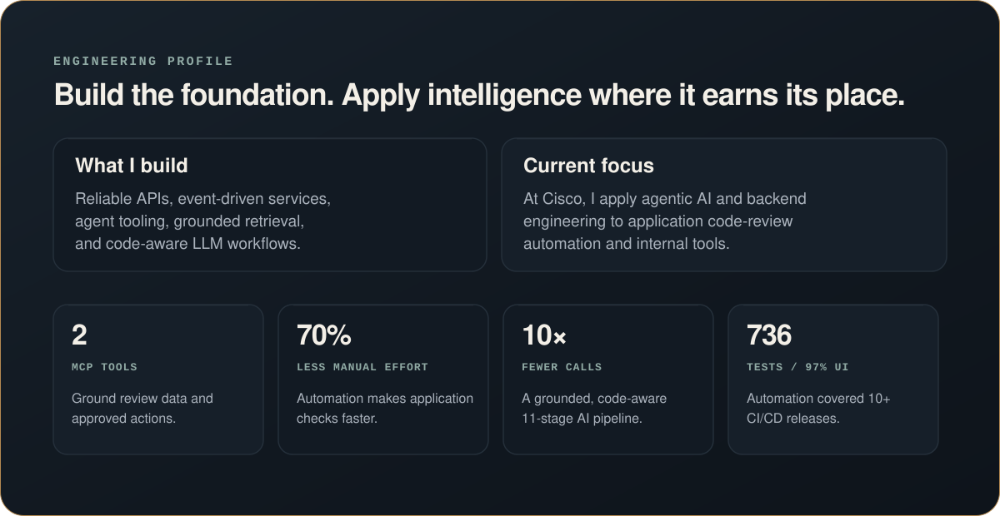
  </picture>

  <picture>
    <source media="(max-width: 600px)" srcset="./assets/profile/projects-header-mobile.svg">
    
  </picture>

  <a href="https://github.com/ManoharEldhandi/model-worklog">
    <picture>
      <source media="(max-width: 600px)" srcset="./assets/profile/project-model-logger-mobile.svg">
      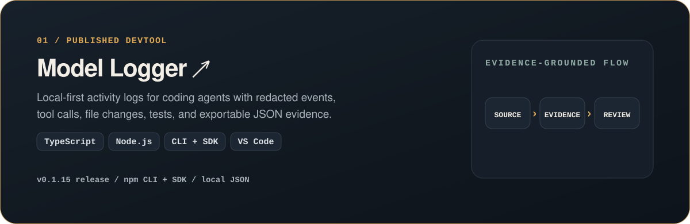
    </picture>
  </a>

  <a href="https://github.com/ManoharEldhandi/agent-contract-lab">
    <picture>
      <source media="(max-width: 600px)" srcset="./assets/profile/project-agent-contract-lab-mobile.svg">
      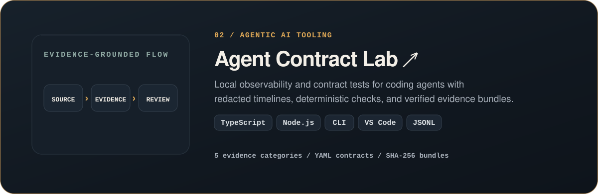
    </picture>
  </a>

  <a href="https://github.com/ManoharEldhandi/OnTheWay">
    <picture>
      <source media="(max-width: 600px)" srcset="./assets/profile/project-ontheway-mobile.svg">
      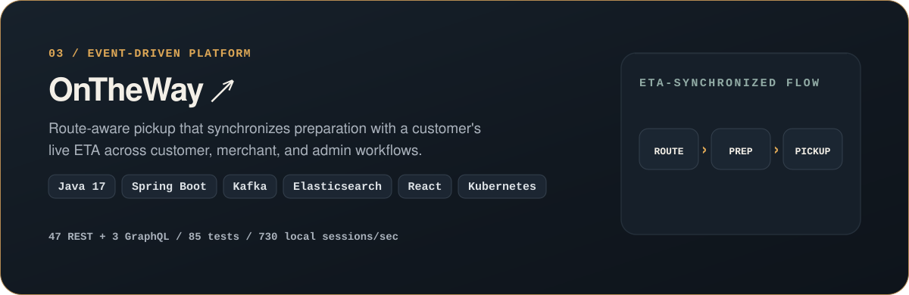
    </picture>
  </a>

  <picture>
    <source media="(max-width: 600px)" srcset="./assets/profile/toolkit-mobile.svg">
    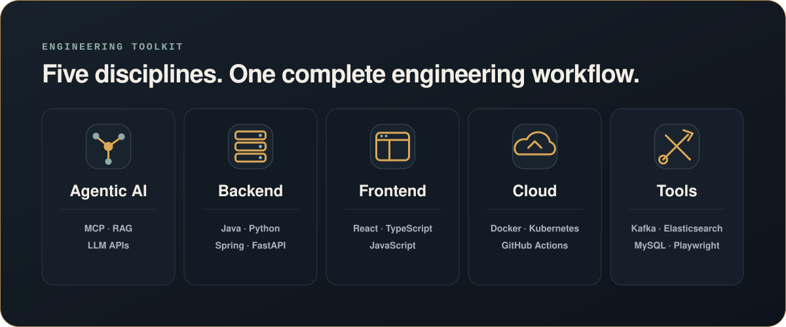
  </picture>

  <picture>
    <source media="(max-width: 600px)" srcset="./assets/profile/highlights-mobile.svg">
    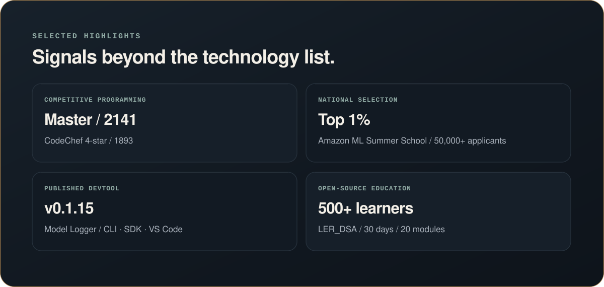
  </picture>

  <a href="https://codeforces.com/profile/ACatLastTry"><picture><source media="(max-width: 600px)" srcset="./assets/profile/nav-codeforces-mobile.svg"></picture></a>&ensp;<a href="https://www.codechef.com/users/acatlasttry"><picture><source media="(max-width: 600px)" srcset="./assets/profile/nav-codechef-mobile.svg"></picture></a>&ensp;<a href="https://github.com/ManoharEldhandi/LER_DSA"><picture><source media="(max-width: 600px)" srcset="./assets/profile/nav-lerdsa-mobile.svg"></picture></a>

  <picture>
    <source media="(max-width: 600px)" srcset="./assets/profile/contributions-mobile.svg">
    
  </picture>

  

  <a href="mailto:eldhandimanohar@gmail.com">
    <picture>
      <source media="(max-width: 600px)" srcset="./assets/profile/footer-mobile.svg">
      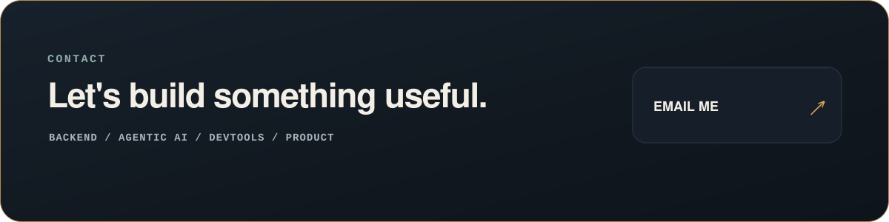
    </picture>
  </a>

